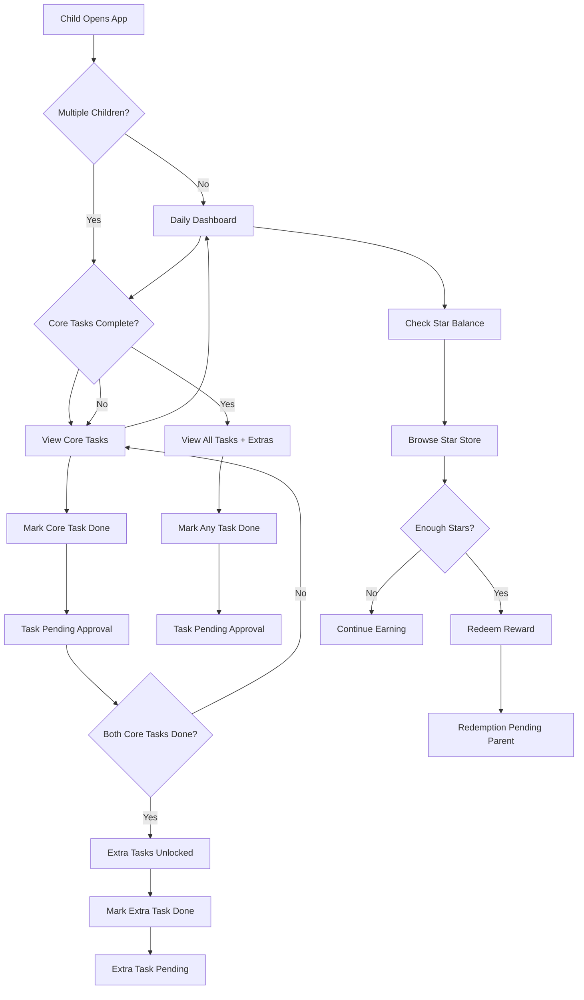
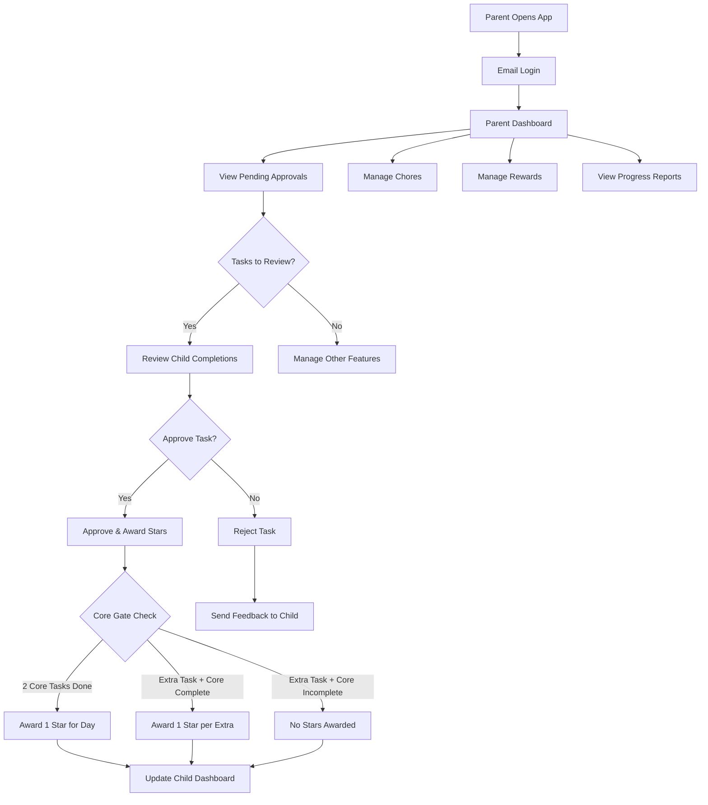
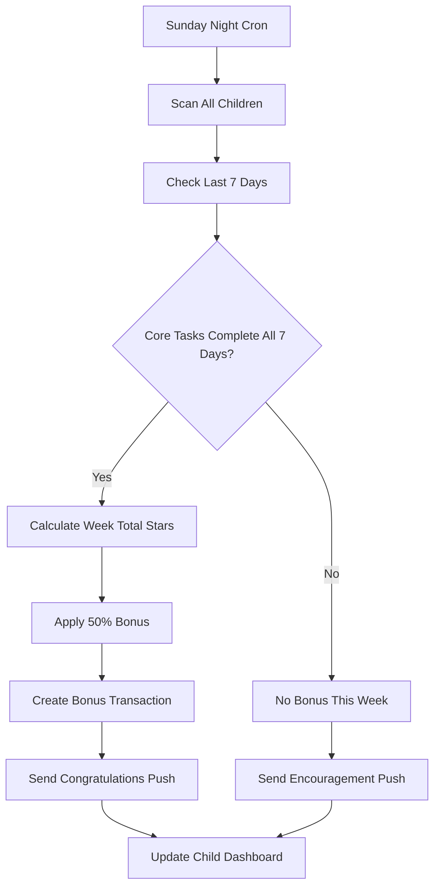
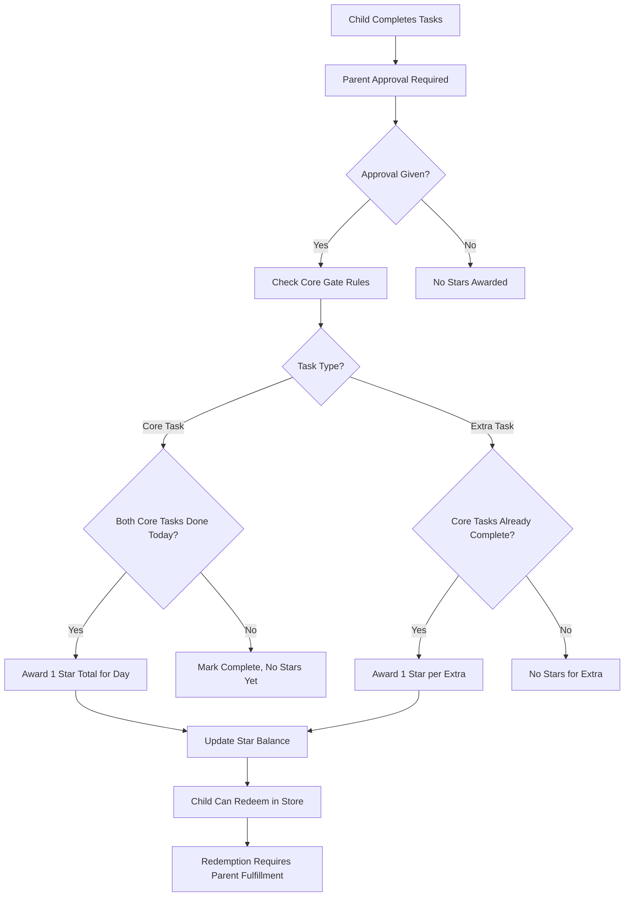

# 🏗️ System Architecture Document (SAD) – StarqueZZ

## Summary

StarqueZZ is a PWA that gamifies chores for kids (5–15) with a parent-approval gate, a star economy, and conditional PIN authentication. The architecture prioritizes offline-first, security via RLS, and simple ops using React + Vite on the client and Supabase (Postgres, Auth, Edge Functions) on the backend.

---

## 1. Architecture Goals & Quality Attributes

- **Offline-first UX**: chores can be viewed/marked offline; sync on reconnect
- **Data integrity**: server-enforced rules (core-gate, 50% bonus) via functions/DB
- **Security**: parent email auth, child short-lived PIN token, Postgres RLS
- **Performance**: <2s initial load on mid devices, smooth interactions
- **Maintainability**: clean modular boundaries, typed contracts, minimal infra
- **Observability**: basic logging/metrics, error capture and replay

---

## 2. High-Level Architecture

### Clients
- **PWA (React + Vite)**: Tailwind CSS + ShadCN UI + Bubble Gum theme, Workbox SW, Dexie (IndexedDB), TanStack Query
- **Dependencies**: `@supabase/ssr`, `vite-plugin-pwa`, `web-push` for VAPID keys
- **Offline Strategy**: TanStack Query optimistic mutations + Dexie fallback queue

### Backend (Supabase)
- **Auth**: email/password for parent, JWT. Child PIN token via Edge Function
- **Database**: Postgres with RLS policies
- **Edge Functions**: chore approval, star ledger updates, weekly bonus job, push broadcast (Deno runtime)
- **Storage**: (optional) for avatars (not used for IP content)
- **Push Notifications**: VAPID keys via `web-push` library in Edge Functions

### Services
- **Web Push**: VAPID keys; push via Edge Function

### Hosting/CI
- **Frontend**: Vercel/Netlify
- **Supabase**: Managed
- **CI**: GitHub Actions (lint/test/build/deploy)

### Architecture Diagram
```
[React PWA]
  ├─ Service Worker (Workbox)
  ├─ IndexedDB (Dexie)
  ├─ UI Layer (ShadCN + TweakCN themes)
  └─ HTTP/WS → [Supabase: Auth, Postgres (RLS), Edge Functions] → [Push]
```

---

## 3. Component Responsibilities

### 3.1 PWA (Frontend)
- **UI Shell**: child mode (PIN for 2+ children), parent mode (email session), base theme tokens
- **Data layer**: TanStack Query (cache, retries), background sync hooks
- **Offline queue**: Dexie tables for actions (mark done, redeem) with replay
- **Theming**: Bubble Gum theme with playful, child-friendly design system
- **Push**: register service worker, store subscription, handle notifications
- **UI Components**: ShadCN base components with Bubble Gum theme

```
index.css
:root {
  --background: oklch(0.9399 0.0203 345.6985);
  --foreground: oklch(0.4712 0 0);
  --card: oklch(0.9498 0.0500 86.8891);
  --card-foreground: oklch(0.4712 0 0);
  --popover: oklch(1.0000 0 0);
  --popover-foreground: oklch(0.4712 0 0);
  --primary: oklch(0.6209 0.1801 348.1385);
  --primary-foreground: oklch(1.0000 0 0);
  --secondary: oklch(0.8095 0.0694 198.1863);
  --secondary-foreground: oklch(0.3211 0 0);
  --muted: oklch(0.8800 0.0504 212.0952);
  --muted-foreground: oklch(0.5795 0 0);
  --accent: oklch(0.9195 0.0801 87.6670);
  --accent-foreground: oklch(0.3211 0 0);
  --destructive: oklch(0.7091 0.1697 21.9551);
  --destructive-foreground: oklch(1.0000 0 0);
  --border: oklch(0.6209 0.1801 348.1385);
  --input: oklch(0.9189 0 0);
  --ring: oklch(0.7002 0.1597 350.7532);
  --chart-1: oklch(0.7002 0.1597 350.7532);
  --chart-2: oklch(0.8189 0.0799 212.0892);
  --chart-3: oklch(0.9195 0.0801 87.6670);
  --chart-4: oklch(0.7998 0.1110 348.1791);
  --chart-5: oklch(0.6197 0.1899 353.9091);
  --sidebar: oklch(0.9140 0.0424 343.0913);
  --sidebar-foreground: oklch(0.3211 0 0);
  --sidebar-primary: oklch(0.6559 0.2118 354.3084);
  --sidebar-primary-foreground: oklch(1.0000 0 0);
  --sidebar-accent: oklch(0.8228 0.1095 346.0184);
  --sidebar-accent-foreground: oklch(0.3211 0 0);
  --sidebar-border: oklch(0.9464 0.0327 307.1745);
  --sidebar-ring: oklch(0.6559 0.2118 354.3084);
  --font-sans: Poppins, sans-serif;
  --font-serif: Lora, serif;
  --font-mono: Fira Code, monospace;
  --radius: 0.4rem;
  --shadow-2xs: 3px 3px 0px 0px hsl(325.7800 58.1800% 56.8600% / 0.50);
  --shadow-xs: 3px 3px 0px 0px hsl(325.7800 58.1800% 56.8600% / 0.50);
  --shadow-sm: 3px 3px 0px 0px hsl(325.7800 58.1800% 56.8600% / 1.00), 3px 1px 2px -1px hsl(325.7800 58.1800% 56.8600% / 1.00);
  --shadow: 3px 3px 0px 0px hsl(325.7800 58.1800% 56.8600% / 1.00), 3px 1px 2px -1px hsl(325.7800 58.1800% 56.8600% / 1.00);
  --shadow-md: 3px 3px 0px 0px hsl(325.7800 58.1800% 56.8600% / 1.00), 3px 2px 4px -1px hsl(325.7800 58.1800% 56.8600% / 1.00);
  --shadow-lg: 3px 3px 0px 0px hsl(325.7800 58.1800% 56.8600% / 1.00), 3px 4px 6px -1px hsl(325.7800 58.1800% 56.8600% / 1.00);
  --shadow-xl: 3px 3px 0px 0px hsl(325.7800 58.1800% 56.8600% / 1.00), 3px 8px 10px -1px hsl(325.7800 58.1800% 56.8600% / 1.00);
  --shadow-2xl: 3px 3px 0px 0px hsl(325.7800 58.1800% 56.8600% / 2.50);
  --tracking-normal: 0em;
  --spacing: 0.25rem;
}

.dark {
  --background: oklch(0.2497 0.0305 234.1628);
  --foreground: oklch(0.9306 0.0197 349.0785);
  --card: oklch(0.2902 0.0299 233.5352);
  --card-foreground: oklch(0.9306 0.0197 349.0785);
  --popover: oklch(0.2902 0.0299 233.5352);
  --popover-foreground: oklch(0.9306 0.0197 349.0785);
  --primary: oklch(0.9195 0.0801 87.6670);
  --primary-foreground: oklch(0.2497 0.0305 234.1628);
  --secondary: oklch(0.7794 0.0803 4.1330);
  --secondary-foreground: oklch(0.2497 0.0305 234.1628);
  --muted: oklch(0.2713 0.0086 255.5780);
  --muted-foreground: oklch(0.7794 0.0803 4.1330);
  --accent: oklch(0.6699 0.0988 356.9762);
  --accent-foreground: oklch(0.9306 0.0197 349.0785);
  --destructive: oklch(0.6702 0.1806 350.3599);
  --destructive-foreground: oklch(0.2497 0.0305 234.1628);
  --border: oklch(0.3907 0.0399 242.2181);
  --input: oklch(0.3093 0.0305 232.0027);
  --ring: oklch(0.6998 0.0896 201.8672);
  --chart-1: oklch(0.6998 0.0896 201.8672);
  --chart-2: oklch(0.7794 0.0803 4.1330);
  --chart-3: oklch(0.6699 0.0988 356.9762);
  --chart-4: oklch(0.4408 0.0702 217.0848);
  --chart-5: oklch(0.2713 0.0086 255.5780);
  --sidebar: oklch(0.2303 0.0270 235.9743);
  --sidebar-foreground: oklch(0.9670 0.0029 264.5419);
  --sidebar-primary: oklch(0.6559 0.2118 354.3084);
  --sidebar-primary-foreground: oklch(1.0000 0 0);
  --sidebar-accent: oklch(0.8228 0.1095 346.0184);
  --sidebar-accent-foreground: oklch(0.2781 0.0296 256.8480);
  --sidebar-border: oklch(0.3729 0.0306 259.7328);
  --sidebar-ring: oklch(0.6559 0.2118 354.3084);
  --font-sans: Poppins, sans-serif;
  --font-serif: Lora, serif;
  --font-mono: Fira Code, monospace;
  --radius: 0.4rem;
  --shadow-2xs: 3px 3px 0px 0px hsl(206.1538 28.0576% 27.2549% / 0.50);
  --shadow-xs: 3px 3px 0px 0px hsl(206.1538 28.0576% 27.2549% / 0.50);
  --shadow-sm: 3px 3px 0px 0px hsl(206.1538 28.0576% 27.2549% / 1.00), 3px 1px 2px -1px hsl(206.1538 28.0576% 27.2549% / 1.00);
  --shadow: 3px 3px 0px 0px hsl(206.1538 28.0576% 27.2549% / 1.00), 3px 1px 2px -1px hsl(206.1538 28.0576% 27.2549% / 1.00);
  --shadow-md: 3px 3px 0px 0px hsl(206.1538 28.0576% 27.2549% / 1.00), 3px 2px 4px -1px hsl(206.1538 28.0576% 27.2549% / 1.00);
  --shadow-lg: 3px 3px 0px 0px hsl(206.1538 28.0576% 27.2549% / 1.00), 3px 4px 6px -1px hsl(206.1538 28.0576% 27.2549% / 1.00);
  --shadow-xl: 3px 3px 0px 0px hsl(206.1538 28.0576% 27.2549% / 1.00), 3px 8px 10px -1px hsl(206.1538 28.0576% 27.2549% / 1.00);
  --shadow-2xl: 3px 3px 0px 0px hsl(206.1538 28.0576% 27.2549% / 2.50);
}

@theme inline {
  --color-background: var(--background);
  --color-foreground: var(--foreground);
  --color-card: var(--card);
  --color-card-foreground: var(--card-foreground);
  --color-popover: var(--popover);
  --color-popover-foreground: var(--popover-foreground);
  --color-primary: var(--primary);
  --color-primary-foreground: var(--primary-foreground);
  --color-secondary: var(--secondary);
  --color-secondary-foreground: var(--secondary-foreground);
  --color-muted: var(--muted);
  --color-muted-foreground: var(--muted-foreground);
  --color-accent: var(--accent);
  --color-accent-foreground: var(--accent-foreground);
  --color-destructive: var(--destructive);
  --color-destructive-foreground: var(--destructive-foreground);
  --color-border: var(--border);
  --color-input: var(--input);
  --color-ring: var(--ring);
  --color-chart-1: var(--chart-1);
  --color-chart-2: var(--chart-2);
  --color-chart-3: var(--chart-3);
  --color-chart-4: var(--chart-4);
  --color-chart-5: var(--chart-5);
  --color-sidebar: var(--sidebar);
  --color-sidebar-foreground: var(--sidebar-foreground);
  --color-sidebar-primary: var(--sidebar-primary);
  --color-sidebar-primary-foreground: var(--sidebar-primary-foreground);
  --color-sidebar-accent: var(--sidebar-accent);
  --color-sidebar-accent-foreground: var(--sidebar-accent-foreground);
  --color-sidebar-border: var(--sidebar-border);
  --color-sidebar-ring: var(--sidebar-ring);

  --font-sans: var(--font-sans);
  --font-mono: var(--font-mono);
  --font-serif: var(--font-serif);

  --radius-sm: calc(var(--radius) - 4px);
  --radius-md: calc(var(--radius) - 2px);
  --radius-lg: var(--radius);
  --radius-xl: calc(var(--radius) + 4px);

  --shadow-2xs: var(--shadow-2xs);
  --shadow-xs: var(--shadow-xs);
  --shadow-sm: var(--shadow-sm);
  --shadow: var(--shadow);
  --shadow-md: var(--shadow-md);
  --shadow-lg: var(--shadow-lg);
  --shadow-xl: var(--shadow-xl);
  --shadow-2xl: var(--shadow-2xl);
}
```

### 3.2 Supabase Edge Functions (Deno Runtime)
- **childLogin**: verify child PIN → short-lived JWT with role=child claim
- **approveCompletions**: parent approves pending → apply core gate, extra rules, create star transactions
- **weeklyBonus (cron)**: compute perfect week + apply +50%
- **pushBroadcast**: send reminders (chores due, streak status) using VAPID keys
- **Offline Sync**: Handle queued actions from Dexie when children come back online

### 3.3 Database (Postgres)
- **RLS**: scope to parent or child claims with custom claims for role-based access
- **Constraints**: guard business rules (enum checks, unique-per-day, FK)
- **Views**: convenience views for dashboards (weekly rollups)
- **RLS Patterns**: Parent-scoped tables (chores, rewards) vs Child-scoped tables (completions, stars)

---

## 4. Data Model (ERD Sketch)

### Tables
- `parent(user_id PK, email UNIQUE, created_at)`
- `child(id PK, parent_id FK→parent.user_id, name, pin_hash, created_at)` - Note: `pin_hash` is nullable for single-child accounts
- `chore(id PK, parent_id FK, title, is_core BOOL, active BOOL)`
- `chore_assignment(id PK, child_id FK, chore_id FK, schedule JSONB, created_at)`
- `chore_completion(id PK, child_id FK, chore_id FK, date DATE, status TEXT CHECK (status IN ('pending','approved','rejected')), marked_by_child_at TIMESTAMP, approved_by_parent_at TIMESTAMP)`
- `star_transaction(id PK, child_id FK, delta INT, reason TEXT CHECK (reason IN ('core_day','extra','weekly_bonus','redeem')), metadata JSONB, created_at)`
- `reward(id PK, parent_id FK, title, cost_stars INT, active BOOL)`
- `reward_redemption(id PK, child_id FK, reward_id FK, cost_stars INT, status TEXT CHECK (status IN ('pending','fulfilled')), created_at, fulfilled_at)`
- `push_sub(id PK, owner_type TEXT CHECK (owner_type IN ('parent','child')), owner_id UUID, endpoint TEXT, p256dh TEXT, auth TEXT, created_at)`

### Key Rules Encoded
- Unique `(child_id, chore_id, date)` in `chore_completion`
- Weekly bonus job scans `chore_completion` for 7-day core completion streaks
- Ledger (`star_transaction`) is append-only

---

## 5. API Surface (selected)

### Auth
- `POST /auth/parent/signin` → Supabase Auth
- `POST /auth/child/login` → returns short-lived child JWT

### Chores
- `GET /child/:id/chores?date=YYYY-MM-DD`
- `POST /child/:id/chores/:choreId/markDone` (child JWT) → create chore_completion (pending)
- `POST /parent/approvals` (parent JWT) → approve list of completions; function applies stars

### Stars & Rewards
- `GET /child/:id/stars/balance`
- `GET /rewards` (parent)
- `POST /redeem` (child → pending, parent fulfills)


### Push
- `POST /push/subscribe` → save subscription
- `POST /push/remind` (system/cron) → broadcast reminders

---

## 6. Sequence Flows

### 6.1 Authentication Flow
1. **Single Child Account**: Direct navigation to child homepage (no PIN required)
2. **Multiple Children (≥2)**: Profile selection screen → PIN prompt for selected child
3. **Parent Access**: Email/password authentication → parent dashboard

### 6.2 Child Marks Chore → Parent Approval → Stars
1. Child (offline/online) taps Mark Done → enqueue completion locally
2. SW/Sync → POST to markDone → creates chore_completion(status=pending)
3. Parent dashboard shows pending items
4. Parent selects items → approveCompletions function:
   - Validate child's two core chores completed today → +1 star (once daily)
   - If core gate passed, each extra completion today → +1 star
   - Create star_transaction rows accordingly
   - Update completion status to approved

### 6.3 Weekly Bonus
1. Cron triggers weeklyBonus
2. For each child: scan last 7 days → if core completed all 7 days, compute 50% of that week's earned stars
3. Insert star_transaction(reason='weekly_bonus', delta=round(week_total*0.5))


---

## 7. Offline & Sync Strategy

- **Caching**: App shell + chore lists cached via Workbox (CacheFirst for assets, NetworkFirst for API)
- **Queues**: Dexie action tables (completionQueue, redeemQueue) + TanStack Query offline mutations
- **Background Sync**: flush queues when online; retries with backoff
- **Conflict Handling**: server is source of truth; client reconciles statuses
- **Optimistic UI**: TanStack Query `useMutation` with `onMutate` for instant feedback
- **Offline Mutations**: TanStack Query handles offline state, Dexie as fallback queue

---

## 8. Security & Privacy

- **Auth**: Parent email/password (Supabase). Child JWT via PIN; short TTL
- **RLS**: All tables enforce parent/child scoping
- **Secrets**: Edge Functions keep VAPID keys
- **Rate Limits**: PIN attempts, markDone frequency, function invocations
- **PII**: Minimal collection; no PII in push payloads

---

## 9. Non-Functional Requirements

- **Performance**: TTI < 2s on mid phones; bundle splitting; image lazy-load
- **Reliability**: At-least-once delivery for queued actions; idempotent functions
- **Accessibility**: WCAG AA; theme contrast validator; large tap targets
- **Compatibility**: iOS/Android/Chrome/Edge/Safari as installed PWAs
- **Scalability**: Start with Supabase; can migrate to Node/Nest + RDS later

---

## 10. Deployment & Environments

- **Envs**: Dev, Staging, Prod (separate Supabase projects & DBs)
- **CI/CD**: PR previews; migrations via supabase/migrations
- **Config**: Env vars for API keys, VAPID

---

## 11. Observability

- **Frontend**: Sentry (errors), Web Vitals, simple logs
- **Backend**: Supabase logs; function structured logging; audit tables
- **Dashboards**: Weekly earned/bonus/redemptions; approval latency

---

## 12. Risks & Mitigations

- **Push on iOS**: requires installed PWA → show onboarding to install; fallback to email for parents
- **Offline conflicts**: idempotent server functions; client reconciliation

---

## 13. Future Extensions

- Move to Node/Nest with Redis jobs when scale needs grow
- Realtime subscriptions for instant dashboards
- Analytics-based dynamic rewards to reduce drop-off
- **Theme System**: AI-generated color palettes based on favorite characters/movies, theme locker where children can switch among parent-approved palettes, child-facing prompt flow for new theme requests

---

## 14. Open Decisions

- Exact schedule format (iCal-like vs simple day-of-week booleans)
- Notification policy (quiet hours, frequency caps)

---

## 15. UI/UX Architecture

### 15.1 Design System
- **Base Framework**: Tailwind CSS for utility-first styling
- **Component Library**: ShadCN UI for consistent, accessible components
- **Theme System**: Bubble Gum theme with playful, child-friendly design
- **Responsive Design**: Mobile-first approach with PWA optimization

### 15.2 Theme Integration
- **Base Theme**: Bubble Gum theme provides playful, child-friendly design foundation
- **Theme Persistence**: Store theme preferences in database and localStorage
- **Roadmap Hooks**: Persist palette library per child to support future child-driven selection workflows

### 15.3 Component Architecture
- **ShadCN Base Components**: Button, Card, Dialog, Form, etc.
- **Custom Components**: ChoreCard, StarDisplay, RewardItem, ThemeSelector
- **Theme-aware Components**: Automatically adapt to base theme system
- **Accessibility**: Large tap targets, high contrast, screen reader support

---

## 16. User Flow Diagrams

### 16.1 Child Daily Flow


### 16.2 Parent Approval Flow


### 16.3 Weekly Bonus Flow



### 16.4 Star Economy Flow


---

This SAD defines the MVP technical blueprint for StarqueZZ.